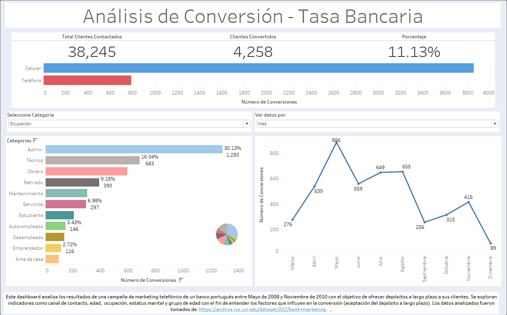

# (ESP) Análisis de Campaña de Marketing Bancario 
En este proyecto se analiza un conjunto de datos reales de una campaña de telemarketing realizada por un banco portugués entre Mayo de 2008 y Noviembre de 2010. El objetivo de la campaña era ofrecer depósitos a largo plazo para sus clientes mediante llamadas telefónicas. A partir del conjunto de datos, se realizó un análisis completo utilizando SQL, Tableau y R (en progreso) para explorar factores asociados a la conversión del cliente (aceptación del producto que en este caso sería el depósito a largo plazo). El proyecto busca identificar patrones que puedan ayudar a optimizar campañas futuras mediante indicadores clave de rendimiento (KPIs por sus siglas en inglés). El dashboard completo puede verse en [**este enlace**](https://public.tableau.com/views/banking_data_17476933621050/DashboardTelemarketing?:language=es-ES&:sid=&:redirect=auth&:display_count=n&:origin=viz_share_link).



# Tecnologías utilizadas
- SQL: Exploración de los datos, agrupamientos y cálculo de KPIs. Esto se llevó a cabo mediante BigQuery
- Tableau: Visualización de tasas de conversión y segmentaciones
- R: Análisis adicional de correlaciones, balance y visualizaciones

Algunos calculos y visualizaciones pueden llegar a repetirse. El fin de esto es demostrar las capacidades para trabajar en diversos entornos

# KPIs analizados 
- Tasa de Conversión global
- Conversión por canal de contacto
- Conversión por grupo de edad
- Conversión por ocupación
- Conversión por mes de contacto y por día de la semana

#Estructura del proyecto 
```
bank-marketing-analysis/
├── data/            <- Datos originales y limpios
├── sql/             <- Consultas SQL por categoría
├── R/               <- Análisis adicional
└── docs/            <- Documentación adicional
```

# Fuentes de datos 
- Conjunto de datos original: [UCI Bank Marketing Dataset](https://archive.ics.uci.edu/dataset/222/bank+marketing)

# Autor 
Abel Rosales G. [Visita mi página web](https://abelrg25.github.io/es/projects/)

# (ENG) Bank Marketing Campaign Analysis

This project analyzes a real dataset from a telemarketing campaign conducted by a Portuguese bank between May 2008 and November 2010. The campaign´s goal was to offer long-term deposit products to clients via phone calls. 

Using SQL, Tableau and R (in progress), this project explores factors related to client conversion, i.e., whether the client accepted the offer. The objective is to identify behavioral patterns and effective segmentation strategies to improve future banking campaigns through key performance indicators (KPIs). You can found the dashboard [**in this link**](https://public.tableau.com/views/banking_data_17476933621050/DashboardTelemarketing?:language=es-ES&:sid=&:redirect=auth&:display_count=n&:origin=viz_share_link).

# Tools 
- SQL: Data exploration, grouping, and KPI calculation 
- Tableau: Visualization of conversion rates and segmentation
- R: Additional analysis of correlations, balances, and visual trends

Some calculations and visualizations might appear more then once. This is intentional, as the goal is to demonstrate the ability to work across different environments. 

# KPIs analyzed 
- Overall conversion rate
- Conversion by contact channel
- Conversion by age group
- Conversion by occupation
- Conversion by month and day of week contact

# Project strutcure 
```
bank-marketing-analysis/
├── data/            <- Original and cleaned data
├── sql/             <- SQL queries by type
├── R/               <- Additional analysis
└── docs/            <- Extra documentation
```

# Data source 
- Original data source: [UCI Bank Marketing Dataset](https://archive.ics.uci.edu/dataset/222/bank+marketing)

# Author
  Abel Rosales G. [Don't forget to visit my webpage](https://abelrg25.github.io/en/projects/)
